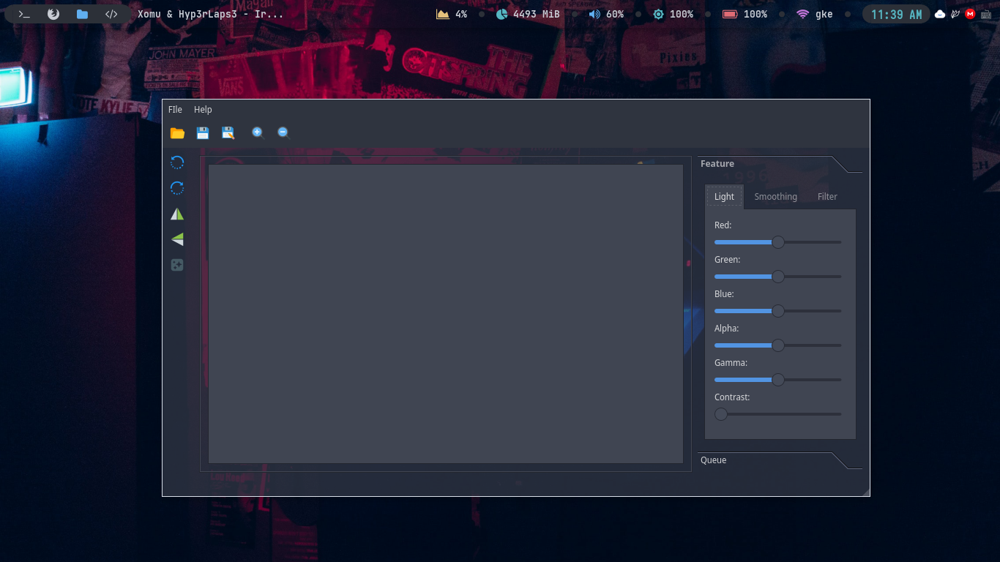
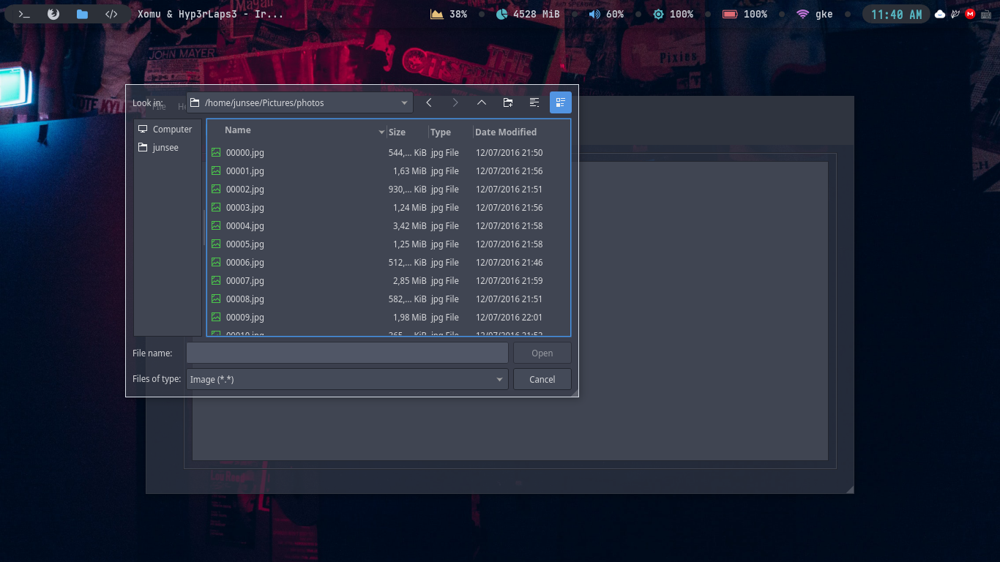
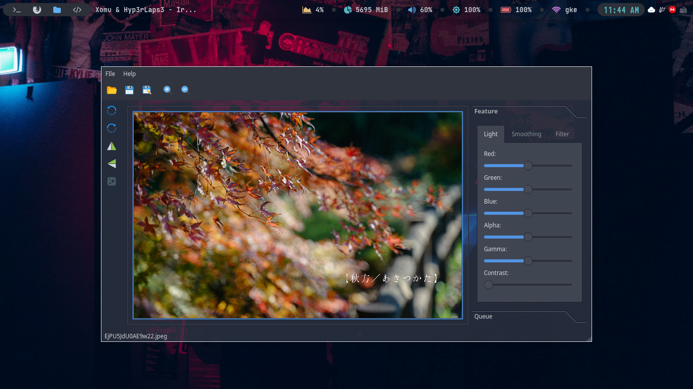
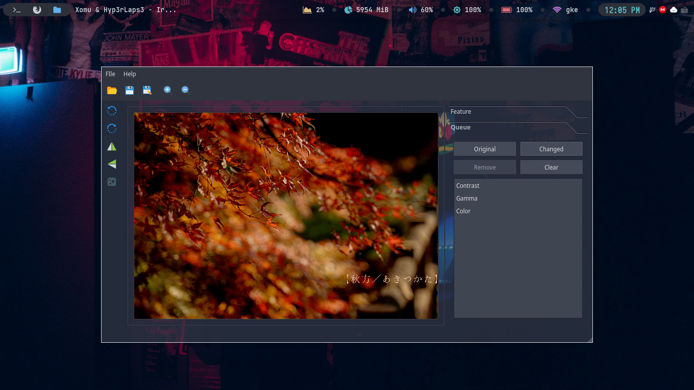

# Image-Processing

## Introduction
- My stupid code **Image Processing** (٭°̧̧̧ω°̧̧̧٭) and most of the code from the internet ヘ(￣ω￣ヘ)
## Library I use
- **Qt5**
- **OpenCV**
## Main GUI

## File Dialog

## Color Adjustment

## Smoothing

## Filter

## Processing Queue
